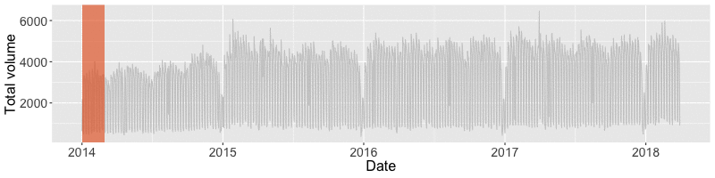

```{r initial, echo = FALSE, cache = FALSE, results = 'hide'}
library(knitr)
options(htmltools.dir.version = FALSE, tibble.width = 60, tibble.print_min = 6)
opts_chunk$set(
  echo = FALSE, warning = FALSE, message = FALSE, comment = "#>",
  fig.path = 'figure/', cache.path = 'cache/', fig.align = 'center', 
  fig.width = 12, fig.show = 'hold', fig.height = 8.5, # 16:9
  cache = TRUE, external = TRUE, dev = 'svglite'
)
read_chunk('R/theme.R')
read_chunk('R/flights.R')
```

```{r theme-remark}
```

```{r load-pkgs}
```

```{r load-data}
```

```{r map-airlines, fig.width = 12, fig.height = 8, fig.show = "hide"}
```

background-image: url(`r fig_chunk("map-airlines", "svg")`)
background-size: cover

class: bottom center

# 2017 US airline traffic: `r NROW(unique(flights$flight))` flights

*data source: [US Bureau of Transportation Statistics](https://www.transtats.bts.gov/DL_SelectFields.asp?Table_ID=236)*

???

22,562 flights

---

.left-column[
<br>
<br>
<br>
<br>
<br>
<br>
<br>
## A glimpse
]
.right-column[
```{r glimpse, echo = TRUE}
```
]

---

```{r n938dn, fig.width = 12, fig.height = 8, fig.show = "hide"}
```

background-image: url(`r fig_chunk("n938dn", "svg")`)
background-size: cover

class: bottom center

# Plane N938DN <br> <br>

---

```{r dl771, fig.width = 12, fig.height = 8, fig.show = "hide"}
```

background-image: url(`r fig_chunk("dl771", "svg")`)
background-size: cover

class: bottom center

# Flight DL771 <br> <br>

???

event data --> slide into time series analysis

---

.pull-left[
<br>
<br>
<br>
<br>
<br>
<br>
<br>
## Timestamped data: sliding into time series analysis
]
.pull-right[
<br>
<br>
<br>
<br>
<br>
```{r print}
```
]

---

.pull-left[
<br>
<br>
<br>
<br>
<br>
<br>
<br>
## Get ready for time series analysis?
]

.pull-right[
<br>
<br>
<br>
<br>
<br>
This data set features:
* heterogeneous data types
* irregular time interval
* multiple measured variables
* multiple grouping variables
]

---

.pull-left[
<br>
<br>
<br>
<br>
<br>
<br>
<br>
## Get ready for time series analysis?
]

.pull-right[
<br>
<br>
<br>
<br>
<br>
But it doesn't fit into:

.x[
* `ts()`
* `zoo()`
* `xts()`
]

The underlying structure is a numeric matrix with implicit time indices.
]

---

.pull-left[
<br>
<br>
<br>
<br>
<br>
<br>
<br>
## Get ready for time series analysis?
]

.pull-right[
<br>
<br>
<br>
<br>
<br>
.animated.hinge[
But it doesn't fit into:

.x[
* `ts()`
* `zoo()`
* `xts()`
]

The underlying structure is a numeric matrix with implicit time indices.
]
]

---

.pull-left[
<br>
<br>
<br>
<br>
<br>
<br>
<br>
## Get ready for time series analysis?
]

.pull-right[
<br>
<br>
<br>
<br>
<br>
.animated.bounceInDown[
.center[]
]
]

---

class: inverse middle center

.pull-left[

.footnote[
.red[reference:] [XKCD on "standards"](https://xkcd.com/927/)
]
]

--

.pull-right[
.center[]
### The 15th time series standard
]

---

.left-column[
<br>
<br>
<br>
<br>
<br>
<br>
## What makes a tsibble?
]
.right-column[
.pull-left[
<br>
.center[


<i class="fas fa-arrow-down"></i>


]
]
.pull-right[
<br>
<br>
<br>
<br>
<br>
<br>
tsibble leverages tibble along with time domain semantics: **index** and **key**.
]
]

---

.left-column[
## What makes a tsibble?
### - index
]
.right-column[
```{r tsibble, echo = TRUE}
```
* Supported index types:
  + **base**: `POSIXct` & `Date`
  + **tsibble**: `yearweek`, `yearmonth` & `yearquarter`
  + **zoo**: `yearmth` & `yearqtr`
  + **nanotime**: `nanotime`
  + `integer`/`double`
* Extensible: define `index_valid()` for custom types
]

---

.left-column[
## What makes a tsibble?
### - index
### - key
]
.right-column[
What's your observational unit over time?

```{r tsibble, echo = TRUE}
```

```{r dl771b, ref.label = "dl771", fig.height = 5}
```
]

---


.left-column[
## What makes a tsibble?
### - index
### - key
]
.right-column[
What's your observational unit over time?

```{r tsibble, echo = TRUE}
```
* Key created via `id()` (identifier)
  + *empty:* univariate time series (implicitit key) `id()`
  + *single:* univariate or multivariate time series `id(flight)`
  + *multiple:* relational structures (nesting or crossing) <br> `id(flight, origin | origin_city_name | orgin_state)`

**tsibble is strict: dinstinct rows identified by index and key.** Use `validate = FALSE` to skip the checks, if you're sure it's a valid input.
]

---

.left-column[
## What makes a tsibble?
### - index
### - key
### - interval
]
.right-column[
Free from specifying time frequency

```{r tsibble, echo = TRUE}
```

By default `regular = TRUE`, it automatically recognizes the time interval based on the index representation from year to day, to nanosecond.

But if you wanna specify the interval, check out the low-level constructor `build_tsibble()`.
]

---

.left-column[
## What makes a tsibble?
### - index
### - key
### - interval
### - tsibble
]
.right-column[
**Arranging the key and index from past to future**
```{r print-tsibble, echo = TRUE}
```
]

---

class: middle

.large[A tsibble consists of a *time index*, *key* and other *measured variables* in a **data-centric** format, which is built on top of the tibble.]

* arbitrary index support
* nesting and crossing data structures
* heterogeneous data types
* list-column

---

class: inverse middle center


## standing on the shoulders of giants

.animated.bounceInRight[
```{r tidyverse, comment = ""}
tidyverse::tidyverse_logo()
```
]

---

.left-column[
## Verbs
### - filter
]
.right-column[
```{r filter, echo = TRUE}
```
]

---

.left-column[
## Verbs
### - filter
### - select
]
.right-column[
Keep the index hanging around with the tsibble

```{r select, echo = TRUE}
```

OR *consciously* leave off the time context by using `.drop = TRUE` or `as_tibble()`.
]

---

.left-column[
## Verbs
### - filter
### - select
### - summarise
]
.right-column[
Aggregate over time
```{r summarise, echo = TRUE}
```
Utilize the context and reduce typing, compared to:
```r
flights %>% 
  group_by(sched_dep_datetime) %>% 
  summarise(avg_delay = mean(dep_delay))
```

]

---

.left-column[
## Verbs
### - filter
### - select
### - summarise
### - index_by*
]
.right-column[
```{r index-by, echo = TRUE}
```
]

---

.left-column[
## Verbs
### - filter
### - select
### - summarise
### - index_by*
]
.right-column[
```{r index-sum, echo = TRUE}
```
* `year()` for yearly aggregation, `yearquarter()` for quarterly, `yearmonth()` for monthly, `yearweek()` for weekly
* other lubridate friends: `floor_date()`, `ceiling_date()`
]

---

class: middle inverse

background-image: url(img/lego.jpg)
background: cover

### .bg-col[Each verb is self-exploratory and helps reason about data analysis.]

### .bg-col[Common tidyverse verbs help reduce cognitive load and make easy transition to time series analysis.]

### .bg-col[The pipe operator %>% chains a sequence of verbs to compose a sound pipeline.]

---

```{r carrier-delayed, include = FALSE}
```

```{r carrier-mosaic-bg, fig.height = 7, fig.show = "hide"}
```

```{r carrier-mosaic, fig.height = 7, fig.show = "hide"}
```

background-image: url(`r fig_chunk("carrier-mosaic-bg", "svg")`)
background-size: 130%
background-position: -200px -50px

class: inverse middle center

## .bg-col[Annual carrier on-time performance]

---

.left-column[
.center[]
### - carrier
]
.right-column[
```{r carrier-delayed, echo = TRUE}
```
]

---

.block[
.flowchart[
* `mutate()` <br> create dummy variable
]
]

```{r carrier1, echo = TRUE}
```

---

.block[
.flowchart[
* `mutate()` <br> create dummy variable
* `index_by() + summarise()` <br> aggregate to annual data
]
]

```{r carrier2, echo = TRUE}
```

---

.block[
.flowchart[
* `mutate()` <br> create dummy variable
* `index_by() + summarise()` <br> aggregate to annual data
* `gather()` <br> melt to long form
]
]

```{r carrier3, echo = TRUE}
```

---

.left-column[
.center[]
### - carrier
]
.right-column[
```{r carrier-mosaic, fig.height = 8}
```

> Delta operates most efficiently among those big carriers.
]

---

```{r nyc-flights}
```
```{r nyc-delay, results = "hide"}
```
```{r nyc-monthly-1, results = "hide"}
```
```{r nyc-monthly-2, results = "hide"}
```
```{r nyc-monthly-plot-bg, fig.height = 7, fig.show = "hide"}
```

background-image: url(`r fig_chunk("nyc-monthly-plot-bg", "svg")`)
background-size: 130%
background-position: -200px -50px

class: inverse middle center

## .bg-col[Daily delay percentages in New York]

---

.left-column[
.center[]
### - carrier
### - nyc
]
.right-column[
```{r nyc-flights, echo = TRUE}
```
```{r nyc-delay, echo = TRUE}
```
]

---

.left-column[
.center[]
### - carrier
### - nyc
]
.right-column[
```{r nyc-delay-plot, fig.height = 8}
```
]

---

## A suite of window functions

.pull-left[
* `slide()`/`slide2()`/`pslide()`: sliding window with overlapping observations
]

.pull-right[

]

---

## A suite of window functions

.pull-left[
* `slide()`/`slide2()`/`pslide()`: sliding window with overlapping observations


* `tile()`/`tile2()`/`ptile()`: tiling window without overlapping observations
]

.pull-right[


]

---

## A suite of window functions

.pull-left[
* `slide()`/`slide2()`/`pslide()`: sliding window with overlapping observations


* `tile()`/`tile2()`/`ptile()`: tiling window without overlapping observations
  

* `stretch()`/`stretch2()`/`pstretch()`: fixing an initial window and expanding to include more observations
]

.pull-right[


]

<hr> 

`purrr`-like interface: `~ mean(.x)`. Functional programming is always fun!

Type-stable: `slide()`/`tile()`/`stretch()` (a list) <i class="fas fa-plus"></i> other variants: `*_dbl()`, `*_int()`, `*_lgl()`, `*_chr()`

---

.left-column[
.center[]
### - carrier
### - nyc
]
.right-column[
## Fixed window size

```{r nyc-weekly-ma, echo = TRUE}
```
]

---

.left-column[
.center[]
### - carrier
### - nyc
]
.right-column[
```{r nyc-weekly-plot, fig.height = 8}
```

> Increase the window size to smooth out short-term fluctuations.
]

---

.left-column[
.center[]
### - carrier
### - nyc
]
.right-column[
## Flexible calendar period

```{r nyc-monthly-1, echo = TRUE}
```
]

---

.left-column[
.center[]
### - carrier
### - nyc
]
.right-column[
## Flexible calendar period

```{r nyc-monthly-2, echo = TRUE}
```
]

---

.left-column[
.center[]
### - carrier
### - nyc
]
.right-column[
```{r nyc-monthly-plot, fig.height = 8}
```

> 2-month moving averages highlight a stable long-term trend.
]

---

```{r quantile, include = FALSE}
```
```{r draw-qtl-prep}
```
```{r draw-qtl-bg, fig.height = 7, fig.show = "hide"}
```

background-image: url(`r fig_chunk("draw-qtl-bg", "svg")`)
background-size: 130%
background-position: -200px -50px

class: inverse middle center

## .bg-col[Hourly upper-tail delay behaviours]

---

.left-column[
.center[]
### - carrier
### - nyc
### - upper tail
]
.right-column[
```{r quantile, echo = TRUE}
```
]

---

.left-column[
.center[]
### - carrier
### - nyc
### - upper tail
]
.right-column[
```{r draw-qtl, fig.height = 8}
```

> Travel smart: avoid flying around 6pm during the day.
]

---

class: middle inverse

background-image: url(img/lego.jpg)
background: cover

### .bg-col[Break up a big problem to into manageable blocks]

### .bg-col[Generate human-readable and error-prone analysis workflow]

---

class: inverse

## Look ahead

<br>
<br>

.center[


### [tidyverts.org](tidyverts.org)
]

---

class: inverse middle center

### Joint work with <i class="fas fa-users"></i> [Di Cook](http://dicook.org) & [Rob J Hyndman](http://robjhyndman.com)

### Slides created via xaringan `r emo::ji("crossed_swords")` <http://slides.earo.me/bigapple>

### More about tsibble <http://pkg.earo.me/tsibble>

### Open source <https://github.com/earowang/bigapple>

### This work is under licensed [<i class="fab fa-creative-commons"></i> BY-NC 4.0](https://creativecommons.org/licenses/by-nc/4.0/).
